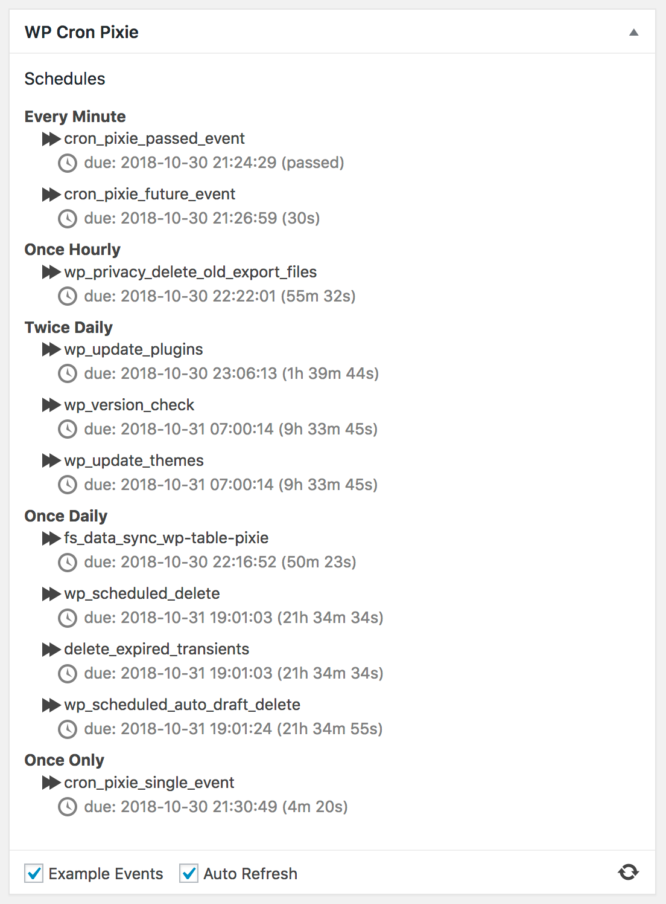

**NOTE:** Moved to [https://git.sr.ht/~ianmjones/wp-cron-pixie](https://git.sr.ht/~ianmjones/wp-cron-pixie)

# WP Cron Pixie

A little dashboard widget to view the WordPress cron, and run an event now rather than later.

## How It Came To Be
This plugin was built for the [Building Reactive WordPress Plugins](https://deliciousbrains.com/building-reactive-wordpress-plugins/) series of articles on the [Delicious Brains Blog](https://deliciousbrains.com/blog/).

1. [Building Reactive WordPress Plugins – Part 1 – Backbone.js](https://deliciousbrains.com/building-reactive-wordpress-plugins-part-1-backbone-js/)
1. [Building Reactive WordPress Plugins – Part 2 – Vue.js](https://deliciousbrains.com/building-reactive-wordpress-plugins-part-2-vue-js/)
1. [Building Reactive WordPress Plugins – Part 3 – Elm](https://deliciousbrains.com/building-reactive-wordpress-plugins-part-3-elm/)

The current version is using Elm on the frontend.

## Bugs & Feature Requests
Please report any issues via our [GitHub Issues list](https://github.com/ianmjones/wp-cron-pixie/issues).
